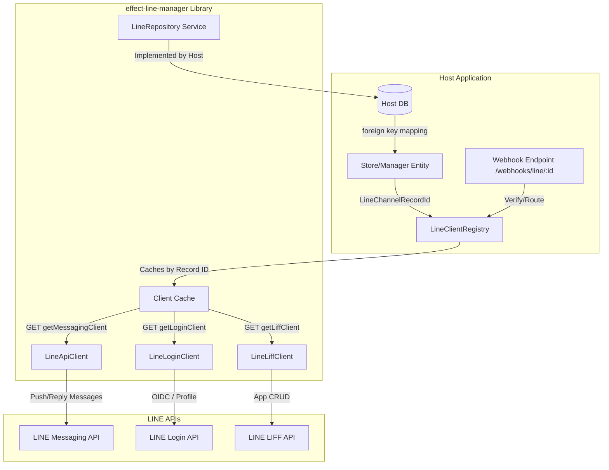

# Effect LINE Manager

An Effect TypeScript v4 library for managing multiple LINE Messaging API
channels, with a headless root entry and optional framework-agnostic Lit web
components and Effect HTTP API integration. Applications supply channel
persistence and an Effect HTTP client; the library resolves credentials,
caches authenticated clients, sends push and reply messages, and verifies
webhook signatures against exact request bytes.

The package intentionally does not include a database adapter, authentication
policy, process-wide runtime, retry policy, or distributed cache.

## Architecture Overview

The library operates on a decoupled, headless core model. Host applications manage their own database relationships (e.g. mapping store models to `LineChannelRecordId`), and use the library's `LineClientRegistry` to fetch authenticated clients at runtime.



## Repository and Registry

Implement `LineRepository` with infrastructure owned by the host application,
then provide it with an `HttpClient.HttpClient` to the registry layer:

```ts
import { Effect, Layer, Schema } from "effect";
import { FetchHttpClient, HttpClient } from "effect/unstable/http";
import {
  LineChannelRecordId,
  LineClientRegistry,
  LineRepository,
  type LineRepositoryService,
} from "effect-line-manager";

declare const repository: LineRepositoryService;

const dependencies = Layer.merge(Layer.succeed(LineRepository)(repository), FetchHttpClient.layer);

const registryLayer = LineClientRegistry.layer().pipe(Layer.provide(dependencies));
const recordId = Schema.decodeUnknownSync(LineChannelRecordId)("line-record-id");

const send = Effect.gen(function* () {
  const registry = yield* LineClientRegistry;
  const client = yield* registry.getMessagingClient(recordId);

  yield* client.pushMessage("U-recipient-id", [{ type: "text", text: "Hello from Effect" }]);
});

Effect.runPromise(send.pipe(Effect.provide(registryLayer)));
```

Repository lookups use `Option<LineAccount>` for absence and fail with
`LineRepositoryError` for infrastructure failures. Mutation adapters must map
native uniqueness and affected-row outcomes explicitly:

- `LineAccountDuplicateChannelError` when the effective scope already contains
  the channel ID.
- `LineAccountNotFoundError` when update or delete finds no scoped record.
- `LineRepositoryError` for foreign infrastructure failures.

Do not infer duplicate or missing-record outcomes by parsing database error
messages.

## Credential Rotation

Clients are cached by LINE channel ID. Invalidate the entry after updating or
deleting credentials so subsequent lookups use current configuration:

```ts
const rotateCredentials = Effect.gen(function* () {
  // Persist the new channel secret or access token first.
  const registry = yield* LineClientRegistry;
  yield* registry.invalidate(recordId);
});
```

The default cache capacity is 500, successful entries live for 30 minutes, and
failed lookups live for 30 seconds. These values are configurable through
`LineClientRegistry.layer(config)`.

## Provider Failure Policy

LINE API requests time out after 30 seconds by default. Override this only at
client construction through `LineApiClientConfig.requestTimeout`. Expected
failures remain distinct so callers can recover precisely:

- `LineApiTimeoutError` for provider timeouts.
- `LineApiAuthenticationError` for HTTP 401 and 403 responses.
- `LineApiRateLimitError` for HTTP 429 responses, including the status and
  `retryAfter` when LINE provides it.
- `LineApiResponseError` for other non-success responses.
- `LineApiTransportError` and `LineRequestEncodingError` for integration
  failures with sanitized defect causes.

The client does not retry automatically. Push retries require a caller-owned
LINE retry key and an application-level policy that can prevent duplicate
sends.

## Reply Messages

```ts
yield * client.replyMessage("reply-token", [{ type: "text", text: "Thanks for your message" }]);
```

Push and reply operations accept one to five text messages. Push operations may
also receive a caller-owned LINE retry key and notification preference.

## Webhook Signatures

Verify the exact raw request bytes before parsing or modifying the body:

```ts
import { Redacted } from "effect";
import { verifyLineSignature } from "effect-line-manager";

yield *
  verifyLineSignature(
    rawRequestBytes,
    request.headers.get("x-line-signature") ?? undefined,
    Redacted.make(channelSecret),
  );
```

`verifyLineSignatureString` is available when the caller already owns the exact
UTF-8 request string. The byte-oriented function is preferred because parsing,
reserialization, whitespace changes, or line-ending normalization invalidate a
LINE signature.

## Optional HTTP API

Import the account-management HTTP contract from the optional
`effect-line-manager/httpapi` entry point. Its routes are relative so the host
chooses the mount prefix:

```text
GET    /line-accounts
POST   /line-accounts
PATCH  /line-accounts/:id
DELETE /line-accounts/:id
```

The API accepts credentials only in create or update payloads. Responses
contain credential-presence booleans but never credential values, prefixes,
suffixes, or masked hints. Omitting a credential during update preserves the
stored value.

Provide the host repository, registry, and management layers explicitly:

```ts
import { Layer } from "effect";
import { FetchHttpClient } from "effect/unstable/http";
import {
  LineAccountManagement,
  LineClientRegistry,
  LineRepository,
  type LineRepositoryService,
} from "effect-line-manager";

declare const repository: LineRepositoryService;

const repositoryLayer = Layer.succeed(LineRepository)(repository);
const registryLayer = LineClientRegistry.layer().pipe(
  Layer.provide(Layer.merge(repositoryLayer, FetchHttpClient.layer)),
);
const managementLayer = LineAccountManagement.layer.pipe(
  Layer.provide(Layer.merge(repositoryLayer, registryLayer)),
);
```

`LineAccountManagementApiLayer` is framework-neutral. For a Fetch handler,
provide the management layer and HTTP platform services, then own disposal:

```ts
import { HttpRouter, HttpServer } from "effect/unstable/http";
import { Layer } from "effect";
import { LineAccountManagementApiLayer } from "effect-line-manager/httpapi";

const apiLayer = LineAccountManagementApiLayer.pipe(
  Layer.provide(managementLayer),
  Layer.provide(HttpServer.layerServices),
);
const { handler, dispose } = HttpRouter.toWebHandler(apiLayer);

// Mount `handler` behind host authentication and authorization middleware.
// Call `await dispose()` during application shutdown.
```

Hosts using `HttpRouter.serve(...)` can combine the same API layer with other
route layers and their selected server implementation.

Create the generated client with a caller-selected base URL and HTTP client,
then bridge it to the web components without creating a hidden runtime:

```ts
import { Effect } from "effect";
import { FetchHttpClient } from "effect/unstable/http";
import {
  makeLineAccountManagementAdapter,
  makeLineAccountManagementClient,
} from "effect-line-manager/httpapi";

const client = await Effect.runPromise(
  makeLineAccountManagementClient({ baseUrl: "/api/admin" }).pipe(
    Effect.provide(FetchHttpClient.layer),
  ),
);
const adapter = makeLineAccountManagementAdapter(client);
```

Executable integration examples are available in
[`examples/httpapi/hono.ts`](examples/httpapi/hono.ts) and
[`examples/httpapi/express.ts`](examples/httpapi/express.ts). The Express 4 and
5 middleware must be mounted before `express.json()` or any other body parser,
because Effect owns the unconsumed request stream.

Authentication, authorization, CORS, CSRF protection, rate limiting, and tenant
selection remain host responsibilities. Mount the API behind authorization
middleware. For multi-tenant applications, resolve the tenant from trusted
authentication context and scope every repository query and uniqueness rule;
never accept an authoritative tenant ID from these request payloads. A
request-scoped tenant service must be supplied through request middleware such
as `HttpApiMiddleware` or `HttpRouter.provideRequest(...)`, not mutable state in
a singleton repository.

The package intentionally has no credential-reveal endpoint. A host-specific
reveal flow requires reauthentication, explicit authorization, auditing,
`Cache-Control: no-store`, and secret-safe logging.

## Web Components

The `effect-line-manager/web` entry is separate from the headless root package.
Importing it does not register custom elements. Register the complete account
management component set explicitly:

To open the included interactive demo with seeded in-memory accounts, run:

```bash
vp dev demo
```

Then open the local URL printed by Vite+, normally `http://localhost:5173/`.
Create, edit, activate, deactivate, and delete operations remain in memory and
reset when the page reloads.

```ts
import {
  defineLineAccountManagementElements,
  type LineAccountManagementAdapter,
} from "effect-line-manager/web";

defineLineAccountManagementElements();

const accounts = document.createElement("line-account-management");
accounts.adapter = {
  list: () => fetch("/line-accounts").then((response) => response.json()),
  create: (input) =>
    fetch("/line-accounts", {
      method: "POST",
      headers: { "content-type": "application/json" },
      body: JSON.stringify(input),
    }).then((response) => response.json()),
  update: (id, input) =>
    fetch(`/line-accounts/${id}`, {
      method: "PATCH",
      headers: { "content-type": "application/json" },
      body: JSON.stringify(input),
    }).then((response) => response.json()),
  delete: (id) => fetch(`/line-accounts/${id}`, { method: "DELETE" }).then(() => undefined),
} satisfies LineAccountManagementAdapter;

document.querySelector("main")?.append(accounts);
```

Adapters and message overrides are object properties, not string attributes.
When the element already exists in markup, assign them after selecting it:

```html
<line-account-management id="line-accounts"></line-account-management>
```

```ts
import type { LineAccountManagement } from "effect-line-manager/web";

const element = document.querySelector<LineAccountManagement>("#line-accounts");
if (element) {
  element.adapter = adapter;
  element.messages = { title: "Connected LINE accounts" };
}
```

Lifecycle and error events bubble and cross Shadow DOM boundaries:

```ts
element?.addEventListener("line-account-created", (event) => {
  const { account } = (event as CustomEvent).detail;
  console.log("Created", account.id);
});

element?.addEventListener("line-account-error", (event) => {
  const { operation, error } = (event as CustomEvent).detail;
  reportError(operation, error);
});
```

English copy is included by default. Supply a partial `messages` object to
override selected strings. Theme the stable surface with CSS custom properties
and `::part()` selectors:

```css
line-account-management {
  --line-account-primary-color: #00a846;
  --line-account-page-background: #f4f7f5;
  --line-account-content-width: 80rem;
  --line-account-radius: 1rem;
}

line-account-management::part(add-button) {
  font-weight: 800;
}
```

React users should assign object properties and native event listeners through
a ref:

```tsx
import { useEffect, useRef } from "react";
import type { LineAccountManagement } from "effect-line-manager/web";

export function LineAccounts({ adapter }: { adapter: LineAccountManagementAdapter }) {
  const ref = useRef<LineAccountManagement>(null);

  useEffect(() => {
    const element = ref.current;
    if (!element) return;
    element.adapter = adapter;

    const handleUpdated = (event: Event) => {
      console.log((event as CustomEvent).detail.account);
    };
    element.addEventListener("line-account-updated", handleUpdated);
    return () => element.removeEventListener("line-account-updated", handleUpdated);
  }, [adapter]);

  return <line-account-management ref={ref} />;
}
```

Consumers building a custom page can register and compose only the primitives
they need:

```ts
import {
  LineAccountCard,
  defineLineAccountCard,
  defineLineAccountDialog,
  defineLineAccountForm,
} from "effect-line-manager/web";

defineLineAccountCard();
defineLineAccountForm();
defineLineAccountDialog();

const card = document.createElement("line-account-card") as LineAccountCard;
card.account = account;
```

## Development

- Install dependencies:

```bash
vp install
```

- Run the unit tests:

```bash
vp test
```

- Format, lint, and type-check:

```bash
vp check
```

- Build the library and declarations:

```bash
vp run build
```
