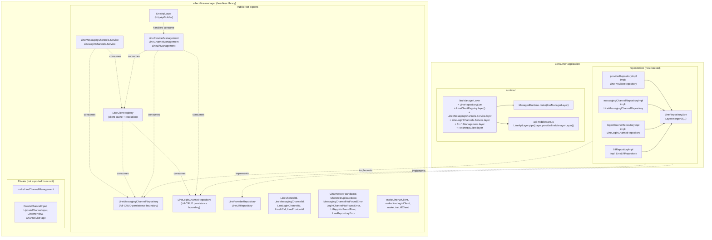

# Integration Guide

This package is storage-agnostic. Host applications own the database schema,
implement repository services, and decide how the current authenticated tenant
or user scopes those repository operations.

## Architecture



## Current domain model

- `LineProvider`
- `MessagingChannel` or `LoginChannel`
- `LineLiffApp`

Relationships:

- provider `1 -> many` channels
- login channel `1 -> many` LIFF apps

Identifier rules:

- internal record identifiers use `LineChannelId` (channels) and `LineLiffId` (LIFF apps)
- external LINE identifiers use `LineMessagingChannelId`, `LineLoginChannelId`, and `LineLiffId`
- public specialized channel IDs stay domain-qualified:
  - `LineMessagingChannelId`
  - `LineLoginChannelId`

## Persistence ports the host must implement

The host application provides concrete `Layer.effect` (or `Layer.succeed`)
implementations for exactly four persistence services exported by the library:

1. **`LineMessagingChannelRepository`** — full-CRUD messaging channel records.
   Importable from the package root (also as `LineMessagingChannels.Repository`).
   Each method works against a single messaging-channel DB table. Method names
   are `create`, `update`, `findByLineChannelId`, `findByBotUserId`,
   `listByProvider`, and `delete` — note that `findByLineChannelId(id)` takes
   the **external LINE Messaging channel ID** (`LineMessagingChannelId` brand),
   not the DB record UUID.
2. **`LineLoginChannelRepository`** — full-CRUD login channel records. Each
   method works against a single login-channel DB table. Login channels do not
   have a `channelAccessToken`, `isActive`, `botUserId`, `basicId`,
   `displayName`, or `pictureUrl` field — the typed input schemas
   (`CreateLoginChannelInput`, `UpdateLoginChannelInput`) enforce this at
   compile time.
3. **`LineProviderRepository`** — provider records.
4. **`LineLiffRepository`** — LIFF app records.

### Skeleton for `LineMessagingChannelRepository`

```ts
import { Effect, Layer, Option, Redacted, Schema } from "effect";
import {
  LineMessagingChannelRepository,
  LineMessagingChannelId,
  LineBotUserId,
  MessagingChannel,
  MessagingChannelNotFoundError,
  ChannelDuplicateError,
  LineRepositoryError,
} from "effect-line-manager";

const messagingChannelRepositoryLayer = Layer.effect(LineMessagingChannelRepository)(
  Effect.gen(function* () {
    const db = yield* MyDb; // consumer-owned
    return LineMessagingChannelRepository.of({
      create: (input) =>
        Effect.tryPromise({
          try: () => db.lineMessagingChannels.create(toRow(input)),
          catch: (cause) => toLineRepositoryError("createMessagingChannel", cause),
        }).pipe(
          Effect.catchIf(isDuplicateKey, () =>
            Effect.fail(
              new ChannelDuplicateError({ channelId: decodeLineChannelId(input.channelId) }),
            ),
          ),
        ),
      update: (id, input) =>
        Effect.tryPromise({
          try: () => db.lineMessagingChannels.updateById(id, toRow(input)),
          catch: (cause) => toLineRepositoryError("updateMessagingChannel", cause),
        }).pipe(
          Effect.flatMap((row) =>
            row === null
              ? Effect.fail(new MessagingChannelNotFoundError({ channelId: id }))
              : Effect.succeed(mapToMessagingChannel(row)),
          ),
        ),
      findByLineChannelId: (id) =>
        Effect.tryPromise({
          try: () => db.lineMessagingChannels.findByChannelId(id),
          catch: (cause) => toLineRepositoryError("findMessagingChannelByLineChannelId", cause),
        }).pipe(Effect.map(Option.fromNullable)),
      findByBotUserId: (botUserId) =>
        Effect.tryPromise({
          try: () => db.lineMessagingChannels.findByBotUserId(botUserId),
          catch: (cause) => toLineRepositoryError("findMessagingChannelByBotUserId", cause),
        }).pipe(Effect.map(Option.fromNullable)),
      listByProvider: (providerId, query) =>
        Effect.tryPromise({
          try: () => db.lineMessagingChannels.listByProvider(providerId, query),
          catch: (cause) => toLineRepositoryError("listMessagingChannelsByProvider", cause),
        }),
      delete: (id) =>
        Effect.tryPromise({
          try: () => db.lineMessagingChannels.deleteById(id),
          catch: (cause) => toLineRepositoryError("deleteMessagingChannel", cause),
        }).pipe(
          Effect.flatMap((deleted) =>
            deleted
              ? Effect.void
              : Effect.fail(new MessagingChannelNotFoundError({ channelId: id })),
          ),
        ),
    });
  }),
);
```

### Skeleton for `LineLoginChannelRepository`

```ts
import { Effect, Layer, Option, Redacted, Schema } from "effect";
import {
  LineLoginChannelRepository,
  LineLoginChannelId,
  LoginChannel,
  LoginChannelNotFoundError,
  ChannelDuplicateError,
  LineRepositoryError,
} from "effect-line-manager";

const loginChannelRepositoryLayer = Layer.effect(LineLoginChannelRepository)(
  Effect.gen(function* () {
    const db = yield* MyDb;
    return LineLoginChannelRepository.of({
      create: (input) =>
        Effect.tryPromise({
          try: () => db.lineLoginChannels.create(toRow(input)),
          catch: (cause) => toLineRepositoryError("createLoginChannel", cause),
        }).pipe(
          Effect.catchIf(isDuplicateKey, () =>
            Effect.fail(
              new ChannelDuplicateError({ channelId: decodeLineChannelId(input.channelId) }),
            ),
          ),
        ),
      update: (id, input) =>
        Effect.tryPromise({
          try: () => db.lineLoginChannels.updateById(id, toRow(input)),
          catch: (cause) => toLineRepositoryError("updateLoginChannel", cause),
        }).pipe(
          Effect.flatMap((row) =>
            row === null
              ? Effect.fail(new LoginChannelNotFoundError({ channelId: id }))
              : Effect.succeed(mapToLoginChannel(row)),
          ),
        ),
      findByLineChannelId: (id) =>
        Effect.tryPromise({
          try: () => db.lineLoginChannels.findByChannelId(id),
          catch: (cause) => toLineRepositoryError("findLoginChannelByLineChannelId", cause),
        }).pipe(Effect.map(Option.fromNullable)),
      listByProvider: (providerId, query) =>
        Effect.tryPromise({
          try: () => db.lineLoginChannels.listByProvider(providerId, query),
          catch: (cause) => toLineRepositoryError("listLoginChannelsByProvider", cause),
        }),
      delete: (id) =>
        Effect.tryPromise({
          try: () => db.lineLoginChannels.deleteById(id),
          catch: (cause) => toLineRepositoryError("deleteLoginChannel", cause),
        }).pipe(
          Effect.flatMap((deleted) =>
            deleted ? Effect.void : Effect.fail(new LoginChannelNotFoundError({ channelId: id })),
          ),
        ),
    });
  }),
);
```

`LineProviderRepository` and `LineLiffRepository` follow the same pattern —
implement each method as an `Effect` that wraps infrastructure failures in
`LineRepositoryError`.

### Error and secret contract

Repository implementations should:

- return `Option.none()` for missing records on lookup methods
- raise the current duplicate/not-found domain errors for business conflicts:
  - messaging channel conflicts: `ChannelDuplicateError` on `create`,
    `MessagingChannelNotFoundError` on `update`/`delete`
  - login channel conflicts: `ChannelDuplicateError` on `create`,
    `LoginChannelNotFoundError` on `update`/`delete`
  - the generic `ChannelNotFoundError` is reserved for `LineChannelManagement`
    (the HTTP API service); consumers raise the domain-specific not-found
    errors from their repository implementations.
  - provider conflicts: `LineProviderNotFoundError`, `LineProviderDuplicateError`
  - LIFF conflicts: `LiffAppNotFoundError`, `LiffAppDuplicateError`
- wrap all infrastructure failures in `new LineRepositoryError({ operation, cause })`
  using one of the per-aggregate literal operation names from
  `LineRepositoryOperation` (e.g. `"createMessagingChannel"`,
  `"findMessagingChannelByLineChannelId"`, `"listMessagingChannelsByProvider"`,
  `"deleteMessagingChannel"` for the messaging aggregate, and
  `"createLoginChannel"`, `"findLoginChannelByLineChannelId"`,
  `"listLoginChannelsByProvider"`, `"deleteLoginChannel"` for the login
  aggregate)
- perform encryption at rest for secrets and access tokens before persistence;
  construct library entities with `Redacted.make(...)` after decrypting

## Registry responsibilities

`LineClientRegistry` is responsible for:

- resolving a messaging client from `LineMessagingChannelId` (via domain services)
- resolving a login client from `LineLoginChannelId` (via domain services)
- resolving a LIFF client from `LineLiffId`
- caching successful and failed lookups
- invalidating channel or LIFF cache entries after mutations

Use:

- `invalidateChannel(channelId: LineChannelId)` — accepts internal record ID
- `invalidateLiff(liffId: LineLiffId)`
- `invalidateAll`

## Public channel contract

Consumers should use the domain-specific public channel APIs:

- `LineMessagingChannels.Repository.create`
- `LineMessagingChannels.Repository.update`
- `LineMessagingChannels.Repository.findByLineChannelId`
- `LineMessagingChannels.Repository.findByBotUserId`
- `LineMessagingChannels.Repository.listByProvider`
- `LineMessagingChannels.Repository.delete`
- `LineLoginChannels.Repository.create`
- `LineLoginChannels.Repository.update`
- `LineLoginChannels.Repository.findByLineChannelId`
- `LineLoginChannels.Repository.listByProvider`
- `LineLoginChannels.Repository.delete`
- `LineMessagingChannels.Service.getClientByLineChannelId`
- `LineMessagingChannels.Service.getAccessTokenByLineChannelId`
- `LineMessagingChannels.Service.invalidateClientByLineChannelId`
- `LineLoginChannels.Service.getByLineChannelId`
- `LineLoginChannels.Service.getLoginClientByLineChannelId`

Both `LineMessagingChannels.Repository` and `LineLoginChannels.Repository` are
full-CRUD ports that host applications implement directly. The library no
longer ships a generic `LineChannelRepository` — channel persistence is split
per aggregate, one repository per LINE channel type, one repository per
physical DB table.

## HTTP API

The `effect-line-manager/httpapi` entrypoint exposes the current CRUD routes:

- providers under `/line-providers`
- channels under `/line-channels`
- LIFF apps under `/line-liff-apps`

Use `LineApiLayer` on the server and `makeLineClient` on the client. If you
need a Promise-based adapter for the reference UI, use
`makeLineProviderManagementAdapter`.
