# Integration Guide

This package is storage-agnostic. Host applications own the database schema,
implement repository services, and decide how the current authenticated tenant
or user scopes those repository operations.

## Architecture

```mermaid
flowchart TD
  subgraph Library["effect-line-manager (headless library)"]
    direction TB

    subgraph PublicSurface["Public root exports"]
      direction LR
      Store["LineChannelRepository<br/>(persistence boundary)"]
      MgmtServices["LineProviderManagement<br/>LineChannelManagement<br/>LineLiffManagement"]
      Registry["LineClientRegistry<br/>(client cache + resolution)"]
      DomainRepos["LineMessagingChannels.Repository<br/>LineLoginChannels.Repository<br/>(read-only, derived from repository)"]
      DomainServices["LineMessagingChannels.Service<br/>LineLoginChannels.Service"]
      Ports["LineProviderRepository<br/>LineLiffRepository"]
      HttpApi["LineApiLayer<br/>(HttpApiBuilder)"]
      Brands["LineChannelId, LineMessagingChannelId,<br/>LineLoginChannelId, LineLiffId, LineProviderId"]
      Errors["ChannelNotFoundError, ChannelDuplicateError,<br/>LiffAppNotFoundError, LineRepositoryError"]
      HttpClients["makeLineApiClient, makeLineLoginClient,<br/>makeLineLiffClient"]
    end

    subgraph PrivateImpls["Private (not exported from root)"]
      Direction["makeLineChannelManagement,<br/>makeLineMessagingChannelRepository,<br/>makeLineLoginChannelRepository"]
      MgmtTypes["CreateChannelInput, UpdateChannelInput,<br/>ChannelView, ChannelListPage"]
    end

    %% Derivation edges
    DomainRepos -. "derived from" .-> Store
    DomainServices -. "uses" .-> DomainRepos
    DomainServices -. "uses" .-> Registry
    Registry -. "uses" .-> Store
    MgmtServices -. "uses" .-> Store
    MgmtServices -. "uses" .-> Registry
    HttpApi -. "handlers consume" .-> MgmtServices
  end

  subgraph Consumer["Consumer application (file: link)"]
    direction TB

    subgraph Repositories["repositories/ (Sequelize-backed)"]
      ProviderRepo["providerRepositoryImpl<br/>impl: LineProviderRepository"]
      ChannelRepo["channelRepositoryImpl<br/>impl: LineChannelRepository"]
      LiffRepo["liffRepositoryImpl<br/>impl: LineLiffRepository"]
      LiveLayer["LineRepositoryLive<br/>Layer.mergeAll(...)"]
      ProviderRepo --> LiveLayer
      ChannelRepo --> LiveLayer
      LiffRepo --> LiveLayer
    end

    subgraph Runtime["runtime/"]
      CompositionRoot["lineManagerLayer<br/>= LineRepositoryLive<br/>+ LineClientRegistry.layer()<br/>+ LineMessagingChannelRepository.layer<br/>+ LineLoginChannelRepository.layer<br/>+ 3 × *.Management.layer<br/>+ FetchHttpClient.layer"]
      ManagedRuntime["ManagedRuntime.make(lineManagerLayer)"]
      EdgeFns["decodeMessagingChannelId(raw) → LineMessagingChannelId<br/>findChannelByChannelId(raw) → MessagingChannel<br/>getMessagingClient / invalidateLineChannel<br/>verifyLineWebhookSignature<br/>getLineChannelAccessToken"]
      ApiMiddleware["api-middleware.ts<br/>LineApiLayer.pipe(Layer.provide(lineManagerLayer))"]

      CompositionRoot --> ManagedRuntime
      ManagedRuntime --> EdgeFns
      CompositionRoot --> ApiMiddleware
    end

    subgraph Tests["tests/line-management/"]
      TestRepos["channel.repository.test.ts<br/>liff.repository.test.ts<br/>provider.repository.test.ts"]
      TestRuntime["effect-runtime.test.ts"]
    end
  end

  %% Consumer → Library implementation edges
  Repositories -. "implements" .-> Store
  Repositories -. "implements" .-> Ports
  Runtime -. "resolves via" .-> DomainRepos
  Runtime -. "resolves via" .-> Registry
```



## Current domain model

- `LineProvider`
- `MessagingChannel` or `LoginChannel`
- `LineLiffApp`

Relationships:

- provider `1 -> many` channels
- login channel `1 -> many` LIFF apps

Identifier rules:

- internal record identifiers use `LineChannelId` (channels) and `LineLiffId` (LIFF apps)
- external LINE identifiers use `LineMessagingChannelId`, `LineLoginChannelId`, and `LineLiffId`
- public specialized channel IDs stay domain-qualified:
  - `LineMessagingChannelId`
  - `LineLoginChannelId`

## Persistence ports the host must implement

The host application provides concrete `Layer.effect` (or `Layer.succeed`)
implementations for exactly three persistence services exported by the library:

1. **`LineChannelRepository`** — generic channel records (messaging + login).
   Importable from the package root. Carries the persistence contract that
   both the registry and the management services consume. Method names are
   `create`, `update`, `findByLineChannelId`, `findByBotUserId`,
   `listByProvider`, and `delete` — note that `findByLineChannelId(id)` takes
   the **external LINE channel ID**, not the DB record UUID.
2. **`LineProviderRepository`** — provider records.
3. **`LineLiffRepository`** — LIFF app records.

### Skeleton for `LineChannelRepository`

```ts
import { Effect, Layer, Option, Redacted } from "effect";
import {
  LineChannelRepository,
  LineChannelId,
  MessagingChannel,
  LoginChannel,
  Schema,
} from "effect-line-manager";

const channelRepositoryLayer = Layer.effect(LineChannelRepository)(
  Effect.gen(function* () {
    const db = yield* MyDb; // consumer-owned
    return LineChannelRepository.of({
      create: (input) =>
        Effect.tryPromise({
          try: () => db.lineChannel.create(toRow(input)),
          catch: (cause) => toLineRepositoryError("createChannel", cause),
        }),
      update: (id, input) =>
        Effect.tryPromise({
          try: () => db.lineChannel.update(id, toRow(input)),
          catch: (cause) => toLineRepositoryError("updateChannel", cause),
        }),
      findByLineChannelId: (id) =>
        Effect.tryPromise({
          try: () => db.lineChannel.findByChannelId(id),
          catch: (cause) => toLineRepositoryError("findChannelByLineChannelId", cause),
        }).pipe(Effect.map(Option.fromNullable)),
      findByBotUserId: (botUserId) =>
        Effect.tryPromise({
          try: () => db.lineChannel.findByBotUserId(botUserId),
          catch: (cause) => toLineRepositoryError("findChannelByBotUserId", cause),
        }).pipe(Effect.map(Option.fromNullable)),
      listByProvider: (providerId, query) =>
        Effect.tryPromise({
          try: () => db.lineChannel.listByProvider(providerId, query),
          catch: (cause) => toLineRepositoryError("listChannelsByProvider", cause),
        }),
      delete: (id) =>
        Effect.tryPromise({
          try: () => db.lineChannel.delete(id),
          catch: (cause) => toLineRepositoryError("deleteChannel", cause),
        }),
    });
  }),
);
```

`LineProviderRepository` and `LineLiffRepository` follow the same pattern —
implement each method as an `Effect` that wraps infrastructure failures in
`LineRepositoryError`.

### Error and secret contract

Repository implementations should:

- return `Option.none()` for missing records on lookup methods
- raise the current duplicate/not-found domain errors for business conflicts:
  - channel conflicts: `ChannelNotFoundError`, `ChannelDuplicateError` (from `effect-line-manager`)
  - provider conflicts: `LineProviderNotFoundError`, `LineProviderDuplicateError`
  - LIFF conflicts: `LiffAppNotFoundError`, `LiffAppDuplicateError`
- wrap all infrastructure failures in `new LineRepositoryError({ operation, cause })`
  using one of the literal operation names from `LineRepositoryOperation` (e.g.
  `"createChannel"`, `"findChannelByLineChannelId"`, `"listChannelsByProvider"`,
  `"deleteChannel"` — the operation enum still uses the channel-domain verb
  names, not the store method names, so the same string works for both the
  internal store and a host adapting to it)
- perform encryption at rest for secrets and access tokens before persistence;
  construct library entities with `Redacted.make(...)` after decrypting

## Registry responsibilities

`LineClientRegistry` is responsible for:

- resolving a messaging client from `LineMessagingChannelId` (via domain services)
- resolving a login client from `LineLoginChannelId` (via domain services)
- resolving a LIFF client from `LineLiffId`
- caching successful and failed lookups
- invalidating channel or LIFF cache entries after mutations

Use:

- `invalidateChannel(channelId: LineChannelId)` — accepts internal record ID
- `invalidateLiff(liffId: LineLiffId)`
- `invalidateAll`

## Public channel contract

Consumers should use the domain-specific public channel APIs:

- `LineMessagingChannels.Repository.findByLineChannelId`
- `LineMessagingChannels.Repository.findByBotUserId`
- `LineLoginChannels.Repository.findByLineChannelId`
- `LineMessagingChannels.Service.getClientByLineChannelId`
- `LineMessagingChannels.Service.getAccessTokenByLineChannelId`
- `LineMessagingChannels.Service.invalidateClientByLineChannelId`
- `LineLoginChannels.Service.getByLineChannelId`
- `LineLoginChannels.Service.getLoginClientByLineChannelId`

Generic channel persistence is internal-only and should not be treated as a
supported consumer contract.

## HTTP API

The `effect-line-manager/httpapi` entrypoint exposes the current CRUD routes:

- providers under `/line-providers`
- channels under `/line-channels`
- LIFF apps under `/line-liff-apps`

Use `LineApiLayer` on the server and `makeLineClient` on the client. If you
need a Promise-based adapter for the reference UI, use
`makeLineProviderManagementAdapter`.
